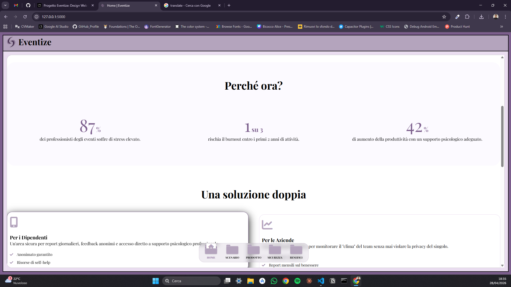
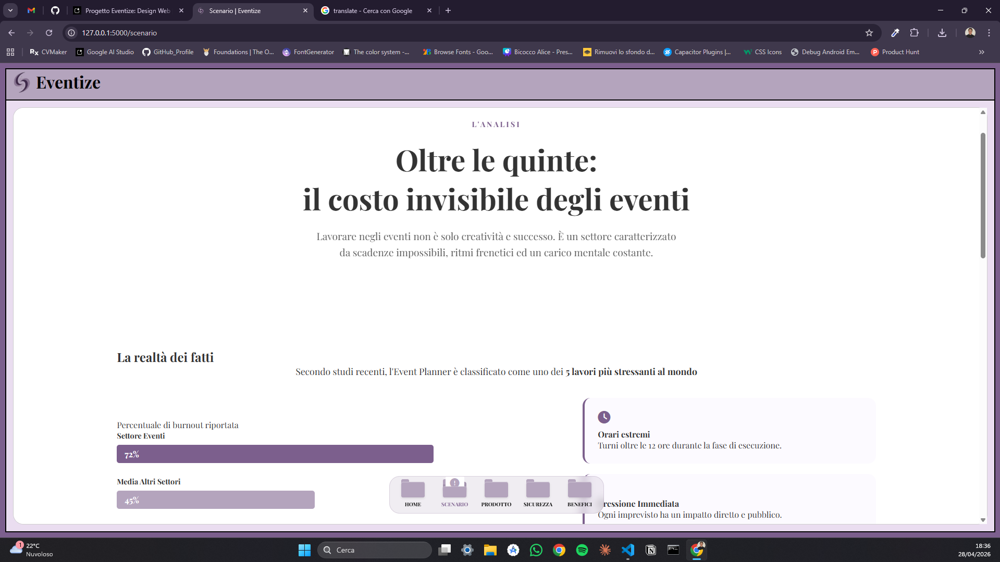
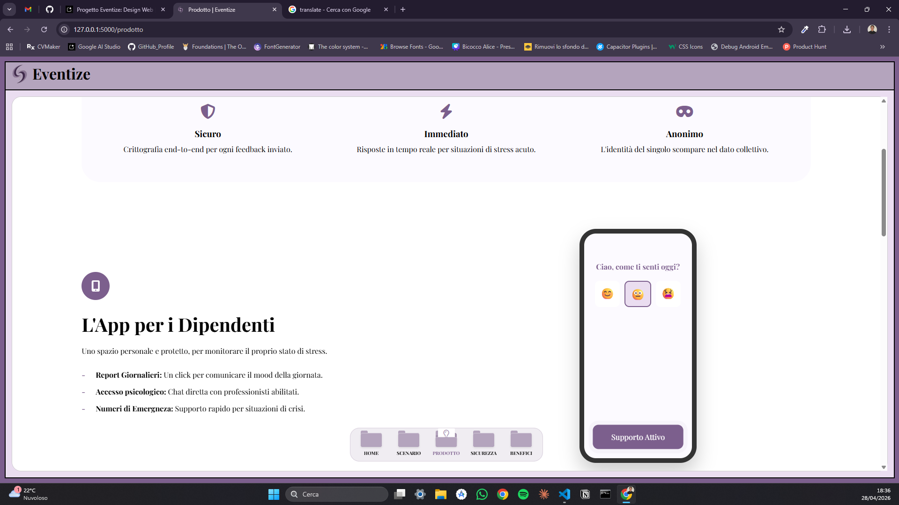
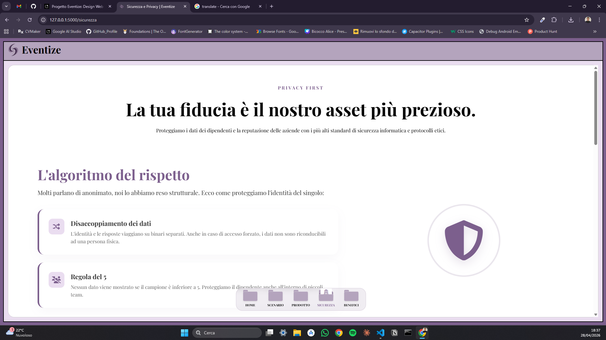
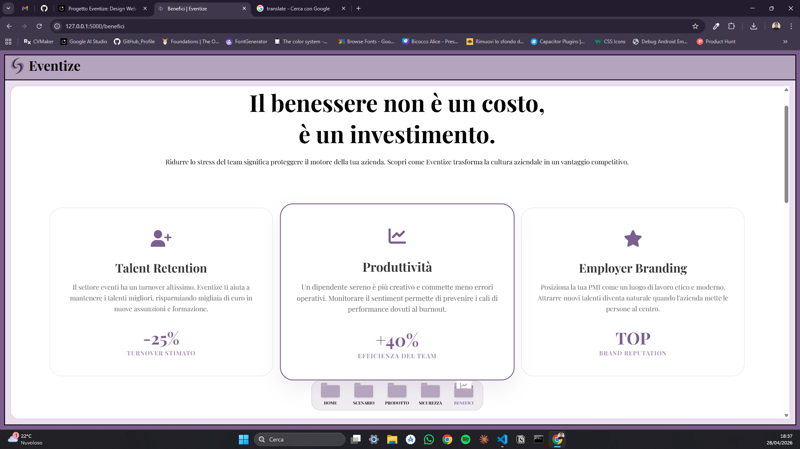
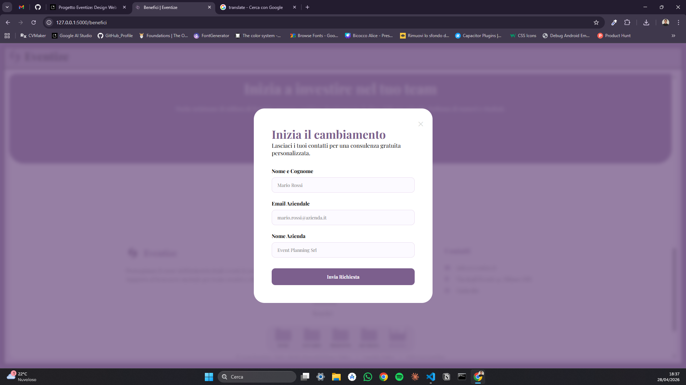

# Eventize

**Mental Wellbeing Supporto for the Events Industry.**

Eventize is a professional B2B platform designed to support the mental health and wellbeing of employees in the events sector. This industry is known for its high-stress enviroment and burnout risks. Eventize provides a dual-interface solution to foster a healthier, more productive workplace.

---

## The Mission
The events industry thrives on creativity and precision, but often at the cost of the team's mental health. Eventize acts as a secure bridge between employee sentiment and corporate decision-making, ensuring that every voice is heard without ever compromising individual privacy.

## Key Features
- **Innovative UX Design:** Features a unique, interactive "Folder Dock" navigation bar built with pure CSS3 animations.

- **Anonimity by Design:** Structural data decoupling and the "Rule of 5" ensure employee identities remain protected while providing valuable insights to management.

- **Dual Interface Solution:**
    - **For Empolyees:** A dedicated mobile space for daily mood tracking, anonymous feedback, and direct access to professional psychological support.

    - **For Companies:** A web dashboard to monitor team sentiment trends, analyze anonymous seggestions, and calculate the ROI of wellbeing.

- **Professional Lead Management:** Automated demo request system using Flask-Mail with custom-designed HTML email templates for both admins and clients.

- **Full Responsiveness:** Seamlessly optimized for desktop, tablet and mobile devices.

## Techincal Stack
- **Backend:** [Python](https://www.python.org/) with [Flask](https://flask.palletsprojects.com/)

- **Frontend:** HTML5, CSS3 (Flexbox & Grid), Vanilla JavaScript

- **Templating Engine:** Jinja2 (Template Inheritance)

- **Security & Config:** Dotenv (Enviroment Variables) for secure credential management

- **Communication:** Flask-Mail (SMTP Integration)

- **Typography & Icons:** Playfair Display (Google Fonts) & Font Awesome

## Live demo
You can view the project here:
- [Click here to view the Live Demo]()

# Screenshots

## Local Setup & Installation
1- Clone the repositories: `git clone https://github.com/Thomas-Attanasio/eventize_website.git`

2- Create a virtual enviroment: `python -m venv venv`

3- Install the dependencies: `pip install -r requirements.txt`

4- Create a `.env` file in the root directory and add your credentials:
    `
        MAIL_USERNAME = your-email@gmail.com
        MAIL_PASSWORD = your-app-password
        MAIL_RECIPIENT = admin-email@eventize.com
        SECRET_KEY = your-random-generated-key
    `

5- Run the application: `python app.py`

---

*Developed with a focus on social impact and corporate innovation.*